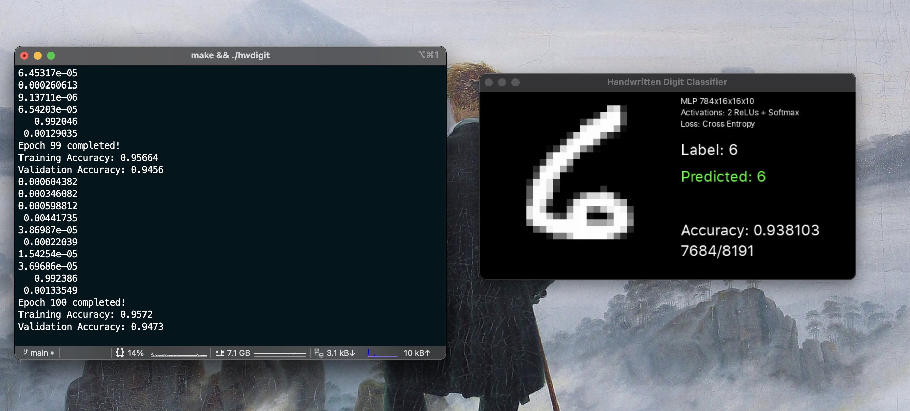

# hwdigit-eigen

Simple handwritten digit recognition on MNIST dataset using MLP neural network with minibatch gradient descent backpropagation using Eigen for matrix multiplication and SDL for displaying testing.

